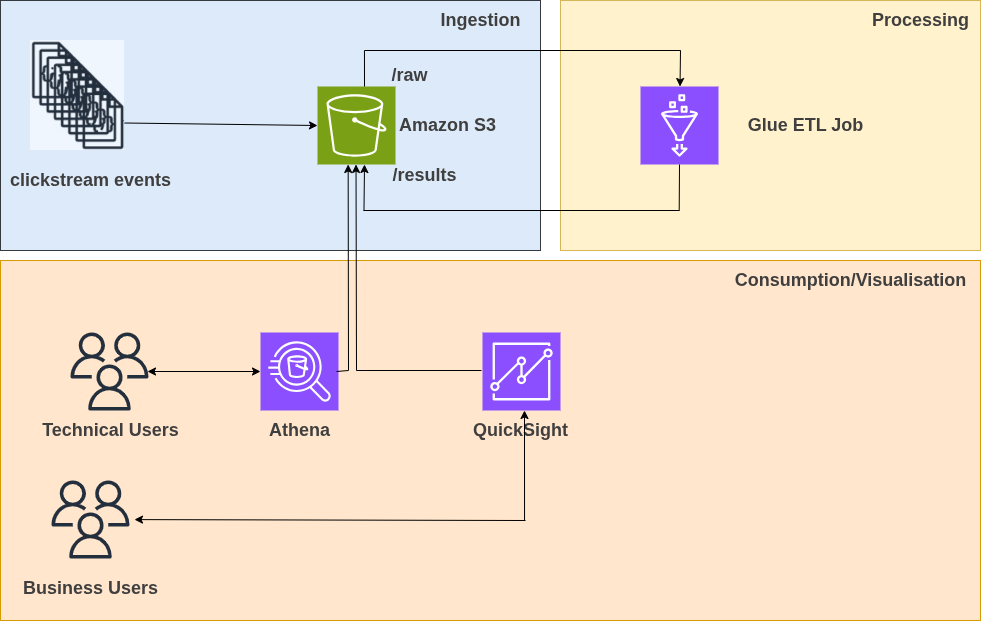
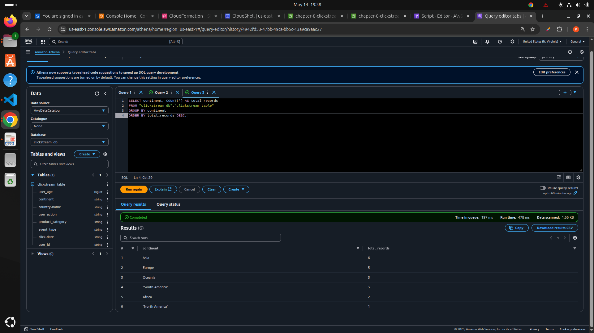
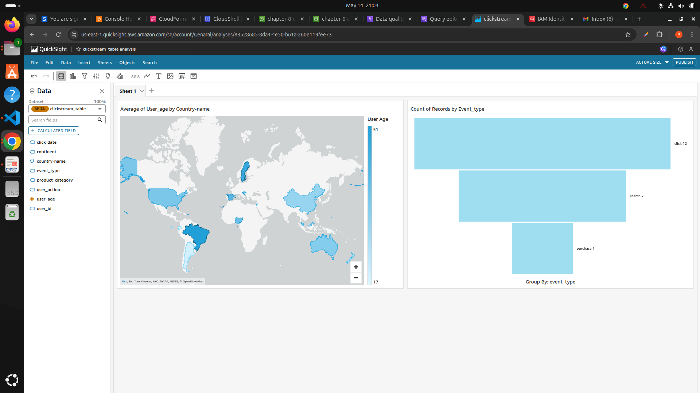
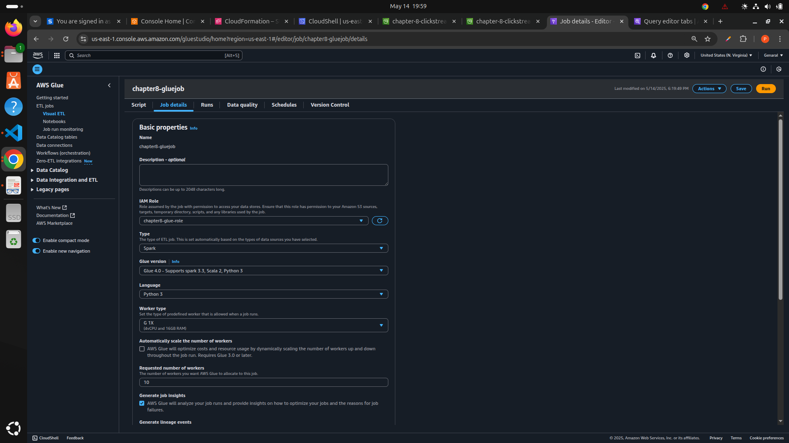

# 📊 Serverless BI Platform

A fully serverless Business Intelligence platform built with AWS Glue, Athena, and QuickSight. It enables automated ETL, scalable analytics, and interactive dashboards using managed AWS services.

---

## 🛠️ What You’ll Build

This project sets up a modern, scalable BI platform by:

- Automating data ingestion and transformation using **AWS Glue**
- Querying data using **Amazon Athena**
- Visualizing insights using **Amazon QuickSight**
- Deploying infrastructure with **AWS CloudFormation**

---

## 🧱 Architecture



---

## 📷 Screenshoots

| Preview | Description |
|--------|-------------|
|  | CloudFormation stack |
|  | Athena |
|  | QuickSight dashboard |
|  | Glue job |

---

### Key Components:

- **Glue Job**: ETL transformation with `generator.py` and `job.py`
- **Athena**: Query structured data stored in S3
- **QuickSight**: Build visual dashboards
- **CloudFormation**: Deploy infrastructure with `ch8-application-template.yaml`

---

## 🚀 Deployment Guide

### 1. Deploy Infrastructure (CloudFormation)

```bash
aws cloudformation deploy \
  --template-file platform/ch8-application-template.yaml \
  --stack-name bi-platform-stack \
  --capabilities CAPABILITY_NAMED_IAM

### 2. Prepare Environment

Install Python dependencies:

```bash
cd aux/
pip install -r requirements.txt
```

### 3. Run ETL Generator

```bash
python generator.py
python job.py
```

### 4. Visualize in QuickSight

* Connect QuickSight to Athena

* Use countries_continents.csv output table

* Create dashboards

---

## 🧪 Testing & Validation

* Test Glue job by checking logs in AWS Glue console

* Validate Athena queries for correct aggregation

* Publish QuickSight dashboards

---

## 📂 Project Structure

```cpp
Serverless-BI-Platform/
├── aux/
│   ├── countries_continents.csv
│   ├── generator.py
│   ├── job.py
│   └── requirements.txt
├── platform/
│   └── ch8-application-template.yaml
└── README.md
```

---

## 📈 Future Improvements

+ Automate the ETL pipeline
+ Automating the life cycle management process

---

## 📄 License

This project is licensed under the MIT License.

---

## 🙋‍♂️ Author

Promise Ugochukwu Nnanemere

+ GitHub: @PromiseUgochukwuNnanemere

+ LinkedIn: in/promiseugochukwunnanemere